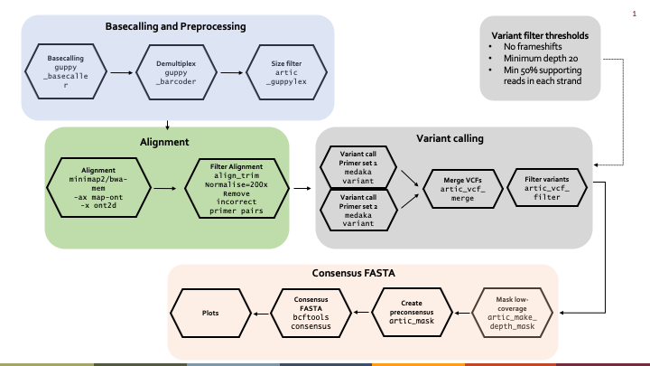
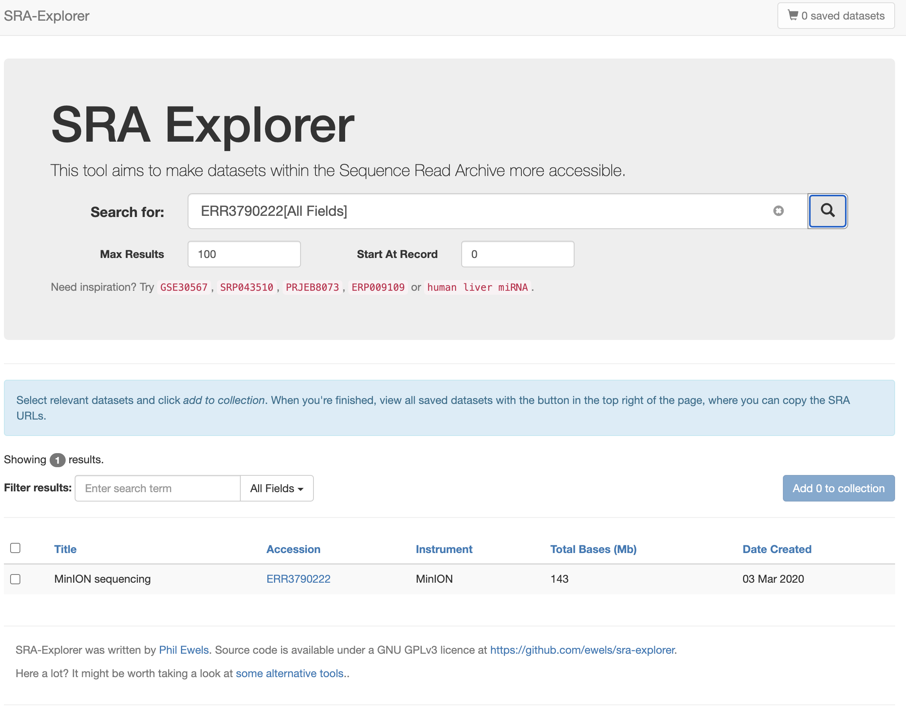

# **Dengue virus sequence data analysis using the artic workflow**
---
###### ***Trainers***: [John Juma](https://github.com/ajodeh-juma), [Gilbert Kibet](https://github.com/kibet-gilbert) & [Kennedy Mwangi](https://github.com/ousodaniel)
---

- [Introduction](#introduction)
- [Scope](#scope)
- [Workflow](#workflow)
- [Background](#background)
- [Prerequisite](#prerequisite)
- [Set-Up](#setup)
- [Preparations](#preparations)
    - [Log into the HPC](#log-into-the-HPC)
    - [Project Organisation](#project-organisation)
    - [Fetching data from public databases](#fetching-data-from-public-databases)
- [Analysis](#analysis)
    - [Loading modules](#loading-modules)
    - [Prepare the reference genome](#prepare-the-reference-genome)
    - [Quality assessment](#quality-assessment)
    - [Preprocessing size filtering](#preprocessing-size-filtering)
    - [Alignment](#alignment)
    - [Post-processing alignment](#post-processing-alignment)
    - [Variant calling](#variant-calling)
    - [Consensus building](#consensus-building)
    - [Visualizing alignments with IGV](#visualizing-alignments-with-igv)


## Introduction
Dengue is a mosquito-borne viral disease that has rapidly spread to all regions of WHO in recent years. Dengue virus is transmitted by female mosquitoes mainly
of the species *Aedes aegypti* and, to a lesser extent, *Ae. albopictus*. These
mosquitoes are also vectors of chikungunya, yellow fever and Zika viruses.

Dengue is widespread throughout the tropics, with local variations in risk influenced by climate parameters as well as social and environmental factors. Dengue is caused by a virus of the Flaviviridae family and there are four distinct, but closely related, serotypes of the virus that cause dengue (DENV-1, DENV-2, DENV-3 and DENV-4).  

## Scope
In this tutorial, we will undertake hands-on data analysis of ampliconic
sequence data from Dengue samples obtained through Oxford Nanopore Technology
(ONT), MinION instrument. The steps performed in the analysis will enable us to 
to generate consensus genome sequences of DENV and identify serotypes.

We will use the [artic](https://artic.readthedocs.io/en/latest/) bioinformatics
pipeline, which is a pipeline and set of accompanying tools for working with
viral nanopore sequencing data, generated from tiling amplicon schemes.

## Workflow

The major steps of the pipeline can be presented as shown in the figure below




## Background

We will use a minimal dataset from [Stubbs
et.al.](https://virologyj.biomedcentral.com/articles/10.1186/s12985-020-1294-6)
study comprising of a archived serum samples from patients in Indonesia and The
Philllipines. Stubbs and team developed a multiplex, short-amplicon approach for
amplifying DENV genomes from clinical samples with low concentrations. They
sequenced the samples using Oxford Nanopore technology and generated consensus
sequences from these amplicons. The generated consensus sequences were shown to
be sufficient for
identifying the geographic origin of the samples, demonstrating that the approach can be a useful tool for identifying and monitoring DENV clades circulating in low-resource settings. 
>**Note**
However, the inaccuracies
in Nanopore-generated consensus sequences mean that the approach may not be
appropriate for higher resolution transmission studies, particularly when more
accurate sequencing technologies are available.


## Prerequisite
- Basic skills in UNIX commandline usage.
- Knowledge on molecular biology and genomics

>**Note**  

>Once logged on the `hpc`, all instances of ```$USER``` will be equivalent to the hpc username that you were assigned, for example `Bio4Info$$`. Your username, by default, is stored in a variable called `USER`. By using it, you will not have to type-in your username, rather, your shell will automatically pick your username which is the value stored in the `USER` variable. The `$` (dollar) character-prefix to a variable name is used to call the value of that variable.

### Set-Up
We will access the tools and software for the analysis using the high
performance computing server on campus.

### Preparation

#### ***Log into the HPC***
From the terminal (or equvalent tool) of your local computer, you can log into the HPC using the folowing command line, followed by pressing <ENTER>. You will be promted to type-in your password (the password will not be visible as you type it; just have faith). On a Linux system, you can use the `Ctrl-Alt-T` 7keyboard shortcut to open a terminal.
```
ssh <user_name>@hpc.ilri.cgiar.org
```
The HPC head node has 4 CPUs and we need to access more CPUs/resources in other compute nodes.
You will have to move from the cluster's master node into the node where we will be working from (it is called `compute05`). Use the following command; `-w` requests (a) specific list of host(s).
```
interactive -w compute05
```

`ssh` allows you to securely connect to the remote computer over internet, while
`interactive` allows you to reserve resources to work interactively in a
specified node within the computing cluster using the `-w` flag.

>**Note**
>When running a job interactively, the time limit is **8 hours** and Default number of **CPU is 1**.

#### ***Project organisation***

1. We then change into the `compute05` `scratch` directory to create our project directory. Using the option`-p` (parent) `mkdir` will create any missing intermediate directories.
    ```
    cd /var/scratch/
    mkdir -p $USER/ont-artic
    cd $USER/ont-artic
    ```
2. The `data, metadata, primer-schemes, scripts` directories will be linked to the project directory, to limit redundancy. `-s` (soft) means that we are creating a soft link.
    ```
    ln -s /var/scratch/global/ont-artic/[dmps]* .
    
    ```
    When you long list `ls -lth` the current directory, you should see
    directories with `l` in the file permissions field as shown below.

    permissions|no|owner|group|size|month|day|time|file/directory
    |---|---|---|---|---|---|---|---|---|
    lrwxrwxrwx.|1|jjuma|jjuma|38|Feb|16|22:43|<strong style="color:green;opacity: 0.80;">data</strong> -> <strong style="color: lightblue; opacity: 0.90;">/var/scratch/global/ont-artic/data</strong>
    lrwxrwxrwx.|1|jjuma|jjuma|38|Feb|16|22:43|<strong style="color:green;opacity: 0.80;">metadata</strong> -> <strong style="color: lightblue; opacity: 0.90;">/var/scratch/global/ont-artic/metadata</strong>
    lrwxrwxrwx.|1|jjuma|jjuma|44|Feb|16|22:43|<strong style="color:green;opacity: 0.80;">primer-schemes</strong> -> /<strong style="color: lightblue; opacity: 0.90;">var/scratch/global/ont-artic/primer-schemes</strong>
    lrwxrwxrwx.|1|jjuma|jjuma|37|Feb|16|22:43|<strong style="color:green;opacity: 0.80;">scripts</strong> -> <strong style="color:lightblue; opacity: 0.90;">/var/scratch/global/ont-artic/scripts</strong>

3. We will create the directories `genomes` and `output` to store raw data in ```fastq``` format, output and reference genomes respectively. Intermediate output files per `tool/software` will be created within the `output` directory. We will exploit the bash array data structure to create all the directories at once.
    ```
    mkdir genomes output
    mkdir -p genomes/DENV2
    mkdir -p output/dataset-002/{fastqc,artic-guppyplex,bwa,minimap2,medaka,bedtools}
    ```  
4. Clear environment
    ```
    module purge
    ```

5. Load required module(s)
    ```
    module load sra-tools/3.0.0
    module load edirect/7.80
    module load fastqc/0.11.9
    module load artic-tools/0.3.1
    module load medaka/1.4.3
    module load longshot/0.4.5
    module load bwa/0.7.17
    ```
6. Hit the `ENTER` key

7. List loaded modules

#### ***Fetching data from public databases***
1. We will use pre-downloaded datasets available as soft links created in the
   second step above.

    >**<strong style="color:yellow;opacity: 0.80;">Optional</strong>**
    >If we had not downloaded the data, we woul have used `sra-tools` to fetch
    >the data
    >We can fetch the raw data in FASTQ format using `sra-tools` from the European Nucleotide
    Archive [(ENA)](https://www.ebi.ac.uk/ena/browser/) database.
    ```
        mkdir /var/scratch/$USER/ont-artic/data/dataset-002/ERR3790222
        fasterq-dump --split-3 --threads 1 --outdir /var/scratch/$USER/ont-artic/data/dataset-002/ERR3790222/ ERR3790222
    ```

    >The above command will download the raw data file in FASTQ format in the
    >directory `/var/scratch/$USER/ont-artic/data/dataset-002/ERR3790222/`. You can
    >make the dowloading process faster by increasing the number of cpus (`threads`) i.e.
    >`--threads 8`

    >**<strong style="color:yellow;opacity: 0.80;">Optional</strong>**

    >Another alternative approach is to use the [SRA explorer](https://sra-explorer.info/) which provides an intuitive
    >   interface for accessing raw data files from Sequence Read Archive [(SRA)](https://www.ncbi.nlm.nih.gov/sra)
    >   or the European Nucleotide
    Archive [(ENA)](https://www.ebi.ac.uk/ena/browser/) databases.
    >style="height:>px; width:27212px;"/>
    >You can select the search results and `Add to collection` and then click on the
    >cart `saved datasets`) to expand the view.
    >Click on the `Fastq Downloads` tab and select the `Bash script for downloading
    >FastQ files` option. 
    > Copy, paste and run on the terminal in your preferred output dirextory. You
    >can rename the files once download is complete

2.  Download reference genome file in FASTA format.
 
    We can programatically retrieve reference genomes from
    [NCBI](https://www.ncbi.nlm.nih.gov/) database if we know the accession(s)
    of the genomes. To achieve this we will use Entrez Programming Utilities
    (E-utilities) toolkit. 

    ```
    esearch -db nucleotide -query "NC_001474.2" | efetch -format fasta > genomes/DENV2/DENV2.fasta
    ```
    **Quiz:** *Display the first 5 lines of the downloaded reference genome?*

    ---
    <details close>
      <summary>Answer</summary>
    
    `>NC_001474.2 Dengue virus 2, complete genome
    AGTTGTTAGTCTACGTGGACCGACAAAGACAGATTCTTTGAGGGAGCTAAGCTCAACGTAGTTCTAACAGTTTTTT
    AATTAGAGAGCAGATCTCTGATGAATAACCAACGGAAAAAGGCGAAAAACACGCCTTTCAATATGCTGAAACGCGA
    GAGAAACCGCGTGTCGACTGTGCAACAGCTGACAAAGAGATTCTCACTTGGAATGCTGCAGGGACGAGGACCATTA
    AAACTGTTCATGGCCCTGGTGGCGTTCCTTCGTTTCCTAACAATCCCACCAA`
    <br>
    </details>

3. Index the reference genome (for visualization using IGV, tablet)
    ```
    samtools faidx /var/scratch/$USER/ont-artic/genomes/DENV2/DENV2.fasta
    ```
    This command generates the index for reference genome with the name `DENV2.fasta.fai`.
#### ***Quality assessment***
Although majorly used in the assessment of Illumina datasets, we can use
[`FastQC`](https://www.youtube.com/watch?v=bz93ReOv87Y) to examine raw read data
from Oxford Nanopore sequencing technologies. The basic
statistics from this report include `total sequences`, `sequence length` and
`%GC`. The tool provides other modules that serve as a starting point in the QC
of your data

1. Change into the  output `fastqc` directory
    ```
    cd /var/scratch/$USER/ont-artic/output/dataset-002/fastqc/
    ```
2. Run `fastqc`
    ```
    fastqc \
        -t 1 \
        --extract \
        -o . \
        /var/scratch/$USER/ont-artic/data/dataset-002/ERR3790222/ERR3790222.fastq
    ```

3. Inspect the output file `fastqc_data.txt`
    ```
    less -S ERR3790222_fastqc/fastqc_data.txt
    ```

    >**<strong style="color:magenta;opacity: 0.80;">Quiz:</strong>**

    - Why was the dot (`.`) used in the `fastqc` command?
    - What does the option `--extract` given in the `fastqc` command perform?
    - In the `fastqc_data.txt`, extract all the lines beginning
    with `>>` and select those without the word `END_MODULE`. **<strong style="color:magenta;opacity:0.80;">Hint</strong>** You can use
    the pattern searching functionality `grep`, 
    - How many modules have passed the quality check?
    - What is total number of sequences? sequences flagged as poor quality? sequence
    lengths distribution? and percetage GC content?


4. Copy the entire `fastqc` output contents to your `home` directory.

   ```
   rsync -avP --partial /var/scratch/$USER/ont-artic/output/dataset-002/fastqc ~/
   ```
5. Copy the `fastqc` directory to you local computer by typing the command. Replace the 
   <strong style="color:green;opacity: 0.80;">USER@</strong> with your actual `username`
    
    scp <strong style="color:green;opacity: 0.80;">USER@</strong>hpc.ilri.cgiar.org:~/fastqc .
    
6. Once copied to your local computer, open the `.html` file with any web browser
   `Mozilla, Google Chrome, Edge, Expoler, Safari` to inspect the results.

7. If you did not succed in getting the output to your computer, kindly follow
   through this link: https://hpc.ilri.cgiar.org/~jjuma/ont-artic/output/dataset-002/fastqc/ERR3790222_fastqc.html

        
#### ***Preprocessing size filtering***
Because ARTIC protocol can generate chimeric reads, we perform length filtering.
This step is performed for each barcode/sample in the run.

From a run on ONT instrument, reads can be categorised as either `PASS` or
`FAIL`. One can perform read filtering on the passed reads while checking for
quality or skipping the quality checking part. Here, we will not skip the quality
checking.

We first collect all the FASTQ files (typically stored in files each containing
4000 reads) into a single file (in this case `ERR3790222.fastq`).

Before we perform read filtering, we can validate the primer schemes to conform
to the ARTIC primer standards/requirements. This will also give us an indication
of the amplicon lengths.

1. Validate the primer scheme   
    ```
    artic-tools validate_scheme \
        -r /var/scratch/$USER/ont-artic/genomes/DENV2/DENV2.fasta \
        /var/scratch/$USER/ont-artic/primer-schemes/DENV2/DENV2.primer.bed
    ```
    >**<strong style="color:magenta;opacity: 0.80;">Quiz:</strong>**

    - How many primer pools are in the scheme?
    - What is the total number of primers in the scheme?
    - What is the minimum and maximum amplicon size expected from this primer scheme?
    - Do the primers span the entire genome?

 

2. Change into the output `artic-guppyplex` directory
    ```
    cd /var/scratch/$USER/ont-artic/output/dataset-002/artic-guppyplex/
    ```
2. Perform size filtering using `artic guppyplex`. We will try the minimum lengths of the amplicons as the minimum, and
    the maximum length of the amplicons plus 200 as the maximum.
    i.e. if your amplicons are 300 and 350 base pairs, use `--min-length 350 --max-length 550`
    ```
    artic guppyplex \
        --min-length 356 \
        --max-length 588 \
        --directory /var/scratch/$USER/ont-artic/data/dataset-002/ERR3790222/ \
        --output ERR3790222.fastq >>ERR3790222.log 2>&1
    ```

    ```
    pigz --no-name --processes 8 ERR3790222.fastq
    ```    

    For SARS-CoV-2, we normally use a length filter here of between 400 and 800 to remove obviously
    chimeric reads.

    >**<strong style="color:yellow;opacity: 0.80;">Repeat the above stepwith
    >different amplicon lengths as shown below</strong>**

    ```
    artic guppyplex \
        --min-length 400 \
        --max-length 800 \
        --directory /var/scratch/$USER/ont-artic/data/dataset-002/ERR3790222/ \
        --output ERR3790222-len400_800.fastq >>ERR3790222-len400_800.log 2>&1
    ```

    ```
    pigz --no-name --processes 8 ERR3790222-len400_800.fastq
    ```

    >**<strong style="color:magenta;opacity: 0.80;">Quiz:</strong>**

    - How many reads pass the filtering process when using amplicon lengths of
      `356` and `588`?
    - How many reads pass the filtering process when using amplicon lengths of
      `400` and `800`?
    - Inspect the `fastqc_data.txt` `Sequence Length Distribution` module and
      correlate these outcomes?

#### ***Alignment***
Aligning sequence reads to a reference genome is the first step in many
comparative genomics pipelines, including pipelines for variant calling,
isoform quantitation and differential gene expression. In many cases, the alignment step is the slowest. This is because for each read the aligner must solve a difficult computational problem: determining the read's likely point of origin with respect to a reference genome. This is always non trivial for several reasons:
- The reference genome is often very big. Searching big things is harder than
  searching small things.
- You aren’t always looking for exact matches in the reference genome–or, at
least, probably not.

The pipeline will perform a reference alignment of the basecalled size filtered reads
against the specified reference sequence. 

[Minimap2](https://github.com/lh3/minimap2) and
[bwa-mem](https://github.com/lh3/bwa) are thee two main aligners used for this
task. Both aligners use their respective ONT presets. 

The alignments are subsequently filtered to keep only `mapped reads`, and then
`sorted` and `indexed`.
We use the option `-F 4` to get mapped reads. More information of the `FLAGS`
can be found at http://samtools.github.io/hts-specs/SAMv1.pdf

Here we use `minimap2`, a versatile sequence alignment program that aligns DNA
or mRNA sequences against a large reference database. Minimap2 also has the
advantage of building the reference index in a single alignment command as
opposed to `bwa` where you have to explicitly build the reference genome index.


1. Change to the `minimap2` directory.
    ```
    cd /var/scratch/$USER/ont-artic/output/dataset-002/minimap2/
    ```  

2. Run the `minimap2` command with `map-ont` preset to align reads to the reference genome.

    ```
    minimap2 \
        -a \
        -x map-ont \
        -t 8 \
        /var/scratch/$USER/ont-artic/genomes/DENV2/DENV2.fasta \
        /var/scratch/$USER/ont-artic/output/dataset-002/artic-guppyplex/ERR3790222.fastq.gz | samtools view -bS -F 4 - | samtools sort -o ERR3790222.sorted.bam -
    ```

3. Index the `sorted` alignment
    ```

    samtools index ERR3790222.sorted.bam
    ```

    >**<strong style="color:yellow;opacity: 0.80;">Optional</strong>**
    >You can alternatively use `bwa-mem` for the alignment. 
    
    - Build the reference genome index
        ```
        bwa index \
            -p /var/scratch/$USER/ont-artic/genomes/DENV2/DENV2 \
            /var/scratch/$USER/ont-artic/genomes/DENV2/DENV2.fasta
        ```
    - Change to the `bwa` output directory
        ```
        cd /var/scratch/$USER/ont-artic/output/dataset-002/bwa/
        ```
    - Map reads to the reference genome, extract mapped reads and sort

        ```
        bwa mem \
            -x ont2d \
            -t 1 \
            /var/scratch/$USER/ont-artic/genomes/DENV2/DENV2 \
            /var/scratch/$USER/ont-artic/output/dataset-002/artic-guppyplex/ERR3790222.fastq.gz | samtools view -bS -F 4 - | samtools sort -o ERR3790222.sorted.bam -
        ```
    - Index the alignment
        ```
        samtools index ERR3790222.sorted.bam
        ```


3. Compute alignment statistics
    ```
    samtools flagstat ERR3790222.sorted.bam
    ```
    >**<strong style="color:magenta;opacity: 0.80 ">Quiz:</strong>**
    - What is the percentage of mapped reads using `minimap2`?

4. Inspect the first few lines of the `sorted` alignment `BAM` file using `samtools view` command
    ```
    samtools view ERR3790222.sorted.bam | less -S
    ```
    >style="height:>px; width:27212px;"/>


#### ***Post-processing alignment***

The purpose of alignment post-processing is:

- assign each read alignment to a derived amplicon
- using the derived amplicon, assign each read a read group based on the primer pool
- softmask read alignments within their derived amplicon

Also, there is the option to:

- remove primer sequence by further softmasking the read alignments
- normalise/reduce the number of read alignments to each amplicon
- remove reads with imperfect primer pairing, e.g. from amplicon read through

By softmasking, we refer to the process of adjusting the CIGAR of each alignment segment such that soft clips replace any reference or query consuming operations in regions of an alignment that fall outside of primer boundaries. The leftmost mapping position of alignments are also updated during softmasking.

3. Trim alignments

    ```
    artic-tools align_trim \
        --normalise 200 \
        --start \
        --remove-incorrect-pairs \
        --report ERR3790222.alignreport.txt \
        <ERR3790222.sorted.bam \
        /var/scratch/$USER/ont-artic/primer-schemes/DENV2/DENV2.primer.bed | samtools sort - -o ERR3790222.trimmed.rg.sorted.bam
    ```

    ```
    samtools index ERR379022.trimmed.rg.sorted.bam
    ```

    ```
    artic-tools align_trim \
      --normalise 200 \
      --remove-incorrect-pairs \
      --report ERR3790222.alignreport.txt \
      <ERR379022.trimmed.rg.sorted.bam \
      /var/scratch/$USER/ont-artic/primer-schemes/DENV2/DENV2.primer.bed | samtools sort - -o ERR3790222.primertrimmed.rg.sorted.bam
    ```
    
    ```
    samtools index ERR379022.primertrimmed.rg.sorted.bam
    ```
**Quiz:** *Compute alignment statistics using `samtools`. What is the mapping
rate of the primer trimmed alignemnts?*


#### ***Variant calling***
Once alignments have been softmasked, sorted and indexed, they are used for
variant calling. This is where the two workflows actually differ.

One can opt to use `nanopolish` or [`medaka`](https://github.com/nanoporetech/medaka). With `nanopolish`, you will require
the signal data in `fast5` format.
If calling variants with `nanopolish`, the pipeline will check the reference
only contains one sequence and then run `nanopolish index` to map basecalled
reads to the signal data.

In this step, we will use `medaka`, a tool to create consensus sequences and variant calls from nanopore sequencing data. This task is performed using neural networks applied a pileup of individual sequencing reads against a draft assembly. It provides state-of-the-art results outperforming sequence-graph based methods and signal-based methods, whilst also being faster.

1. Generate a consensus sequence for each read group as determined by the primer
   pools

    ```
    medaka consensus \
        --model r941_min_high_g360 \
        --threads 1 \
        --RG 1 \
        /var/scratch/$USER/ont-artic/output/dataset-002/medaka/ERR3790222.primertrimmed.rg.sorted.bam \
        ERR3790222.1.hdf
    ```

    ```
    medaka consensus \
        --model r941_min_high_g360 \
        --threads 1 \
        --RG 2 \
        /var/scratch/$USER/ont-artic/output/dataset-002/medaka/ERR3790222.primertrimmed.rg.sorted.bam \
        ERR3790222.2.hdf
    ```

2. Identify variants including <strong style="color:grey;opacity: 0.80;">
   detection of INDELS</strong> for each read group.

   ```
   medaka variant \
    /var/scratch/$USER/ont-artic/genomes/DENV2/DENV2.fasta \
    ERR3790222.1.hdf \
    ERR3790222.1.vcf
   ```

   ```
   medaka variant \
    /var/scratch/$USER/ont-artic/genomes/DENV2/DENV2.fasta \
    ERR3790222.2.hdf \
    ERR3790222.2.vcf
   ```

3. Merge, compress and index vcf files

    ```
    artic_vcf_merge \
        ERR3790222 \
        /var/scratch/$USER/primer-schemes/DENV2/DENV2.primer.bed 2>ERR3790222.primersitereport.txt \
        2:ERR3790222.2.vcf \
        1:ERR3790222.1.vcf
    ```

    ```
    bgzip -f ERR3790222.merged.vcf
    ```

    ```
    tabix -f -p vcf ERR3790222.merged.vcf.gz
    ```

4. Annotate INDELS, filter, compress and filter vcfs

- `-P` Remove a variant if the allele observations are biased toward one strand
(forward or reverse) according to Fisher's exact test. 
- `-A` Automatically calculate mean coverage for region and set max coverage to
  mean_coverage +5*sqrt(mean_coverage)
- `-F` If output files (VCF or variant debug directory) exist, delete and
  overwrite them.
- `--no_haps` Don't call HapCUT2 to phase variants.


    ```
    longshot \
        -P 0 \
        -F \
        -A \
        --no_haps \
        --bam /var/scratch/$USER/ont-artic/output/dataset-002/medaka/ERR3790222.primertrimmed.rg.sorted.bam \
        --ref /var/scratch/$USER/ont-artic/genomes/DENV2/DENV2.fasta \
        --out ERR3790222.merged.vcf \
        --potential_variants ERR3790222.merged.vcf.gz
    ```
    Filter the merged variant file through a set of workflow specific checks and
    assign all variants as either PASS or FAIL. The final PASS file is subsequently
    indexed ready for the next stage.
    ```
    artic_vcf_filter \
        --medaka ERR3790222.merged.vcf \
        ERR3790222.pass.vcf \
        ERR3790222.fail.vcf
    ```

    ```
    tabix -p vcf ERR3790222.pass.vcf.gz
    ```


#### ***Consensus building***
Prior to building a consensus, we use the post-processed alignment from the
previous step to check each position of the reference sequence for sample
coverage. Any position that is not covered by at <strong style="color:green;opacity: 0.80;">least 20
reads</strong> from either read group are marked as low coverage. We use the
`artic_make_depth_mask` module for this, which produces coverage information for
each read group and also produces a coverage mask to tell us which coordinates
in the reference sequence failed the coverage threshold.


1. Compute coverage
    ```
    artic_make_depth_mask \
        --store-rg-depths \
        /var/scratch/$USER/ont-artic/genomes/DENV2/DENV2.fasta \
        /var/scratch/$USER/ont-artic/output/dataset-002/medaka/ERR3790222.primertrimmed.rg.sorted.bam \
        ERR3790222.coverage_mask.txt
    ```

2. Mask low depth regions

    ```
    artic_mask \
        /var/scratch/$USER/ont-artic/genomes/DENV2/DENV2.fasta \
        ERR3790222.coverage_mask.txt \
        ERR3790222.fail.vcf \
        ERR3790222.preconsensus.fasta
    ```

3. Generate preconsensus sequence

    ```
    bcftools consensus \
        -f ERR3790222.preconsensus.fasta \
        ERR3790222.pass.vcf.gz \
        -m ERR3790222.coverage_mask.txt \
        -o ERR3790222.consensus.fasta
    ```

4. Rename the header of the consensus

    ```
    artic_fasta_header \
        ERR3790222.consensus.fasta \
        "ERR3790222/ARTIC/medaka"
    ```

##### **VCF file format**
    
The header begins the file and provides metadata describing the body     of the file. 
Header lines are denoted as starting with `#`. 
Special keywords in the header are denoted with `##`.
Recommended keywords   include fileformat, fileDate and reference.

The header contains keywords that optionally semantically and      syntactically describe the fields used in the body of the file, notably INFO, FILTER, and FORMAT.


|   |      Name    |  Brief description (see the specification for details)[VCF](https://samtools.github.io/hts-specs/VCFv4.1.pdf).  |
|---|:-------------|:---------------------------------------------------------|
| 1 |  CHROM       |The name of the sequence (typically a chromosome) on which the variation is being called.                                                           |
| 2 |  POS         |The 1-based position of the variation on the given sequence.                                                          |
| 3 |  ID          |The identifier of the variation, e.g. a dbSNP rs identifier, or if unknown a ".". Multiple identifiers should be separated by semi-colons without white-space.                                                           |
| 4 |  REF         |The reference base (or bases in the case of an indel) at the given position on the given reference sequence.                                                          |
| 5 |  ALT         |The list of alternative alleles at this position.                                                           |
| 6 |  QUAL        |A quality score associated with the inference of the given alleles.                                                          |
| 7 |  FILTER      |A flag indicating which of a given set of filters the variation has failed or PASS if all the filters were passed successfully.                                                          |
| 8 |  INFO        |An extensible list of key-value pairs (fields) describing the variation.                                                          |
| 9 |  FORMAT      |An (optional) extensible list of fields for describing the samples                                                          |
| + |  SAMPLES     |For each (optional) sample described in the file, values are given for the fields listed in FORMAT                                                           |
#### ***Visualizing alignments with IGV***
>style="height:>px; width:27212px;"/>

#### ***Compute coverage***
Here we will use [bedtools](https://github.com/arq5x/bedtools2), a genomic
arithmetic and interval manipulation tool.

1. Change to the output directory ```bedtools```
    ```
    cd /var/scratch/$USER/ont-artic/output/dataset-002/bedtools/
    ```  

2. Compute coverage
    ```
    bedtools \
        genomecov \
        -d \
        -ibam \
        /var/scratch/$USER/ont-artic/output/dataset-002/medaka/ERR3790222.primertrimmed.rg.sorted.bam \
        > ERR3790222.coverage
    ```
3. Plot to visualize

    ```
    Rscript /var/scratch/$USER/ont-artic/scripts/plotGenomecov.R ERR3790222.coverage
    ```

> **Note**

> This training is an initiative of the [Africa
CDC](https://africacdc.org/), [African Society for Laboratory
Medicine](https://aslm.org/) and the [International Livestock Research
Institute](https://ilri.org) with generous support from the [Mastercard Foundation](https://mastercardfdn.org/) to build
capacity in pathogen genomics
in Africa.

---

***Computation-wise, whichever way (poor/good) you choose to organise your data, ensure consistency***.

---
[](https://creativecommons.org/licenses/by/4.0/)
